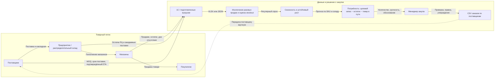

# Общая схема пополнения склада

Схема показывает бизнес-контур предприятия, поставщиков и магазинов, а также место сервиса расчёта заказов. Стрелки подписаны типом передаваемого товара, документа или данных.

Цикл замыкается после подтверждения и поставки: предприятие обновляет товары в пути и остатки в учётной системе, магазины продолжают продажи, а следующий расчёт использует свежие данные. Это общая процессная схема, не обещание готовых интеграций.

**Граница текущего MVP:** сервис принимает подготовленный XLSX/JSON, рассчитывает рекомендации, даёт менеджеру изменить количество и локально утвердить CSV. Прямого подключения к 1С, отправки заказов поставщикам и оптимизации перемещений между РЦ и магазинами пока нет. Точные периоды stockout, обезличенный ID клиента и сроки поставки требуют дополнительных данных партнёра; см. [карту материалов](TEAM_HANDOFF.md#5-переданные-материалы-и-безопасная-работа-с-ними).
